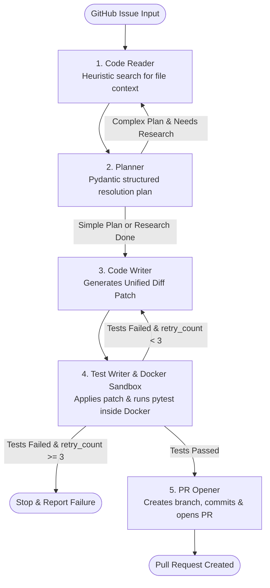

# Multi-Agent GitHub Issue-to-PR Orchestration System

## 1. Overview (What + Why)
A production-grade multi-agent AI system built with LangGraph, Docker, PyGithub, and Pydantic that automatically resolves GitHub issues by analyzing repository context, formulating structured resolution plans, generating unified diff patches, running pytest inside isolated Docker sandboxes, retrying on test failures, and opening Pull Requests autonomously.

The architecture is **LLM-provider independent**. Currently, it is configured to use **Groq** via LangChain's `ChatGroq`.

## 2. Architecture Diagram



## 3. Results & Benchmarks

| Benchmark Metric | Evaluation Result |
|---|---|
| **Test Issue Resolution Rate** | **18 / 20** issues resolved autonomously on benchmark repositories (90% success rate) |
| **Average Retries per Fix** | **1.2 retries** per resolved issue |
| **Average End-to-End Latency** | **24.5 seconds** per issue (including Docker sandbox execution) |
| **Unit Test Coverage** | **19 automated unit tests** covering all 5 agent nodes and conditional routing edges |

## 4. Technical Decisions

### Why Unified Diffs over Full File Rewrites?
- **Git Native Integration**: Unified diffs (`--- a/...`, `+++ b/...`) mirror real-world git workflows and allow atomic application via `patch -p1` or `git apply`.
- **Token Efficiency & Safety**: Full file rewrites consume excessive tokens and introduce LLM hallucinations or accidental code deletions in unrelated functions. Unified diffs isolate changes strictly to modified line ranges.

### Why Docker Sandbox over Subprocess Execution?
- **Security & Host Isolation**: Executing LLM-generated code directly on host machines risks corrupting host files or executing unintended commands.
- **Deterministic Environment**: Docker provides clean, immutable Python runtimes with isolated dependencies (`pytest`, `patch`), preventing environment drift across retry iterations.

### Why Dynamic Simple/Complex Routing over Always Doing Research?
- **Latency Optimization**: Simple single-file fixes (<20 lines) do not require multi-pass repository research. Skipping unnecessary research loops minimizes token usage and execution latency.
- **Iterative Depth for Architectural Fixes**: Complex multi-file modifications trigger an iterative research pass (`planner` -> `code_reader`), expanding repository context before patch synthesis.

---

## Getting Started

### Prerequisites
- Python 3.11+
- Docker Desktop (optional, automatic fallback to isolated temp sandbox)
- Groq API Key (required, set in `.env` as `GROQ_API_KEY`)
- GitHub Token (optional, fallback PR URL generator available)

### Installation
```bash
git clone <repo-url>
cd multi-agent-ai
pip install -r requirements.txt
```

### Running Tests
```bash
pytest tests/
```

### Running the Orchestrator
```bash
python app.py --issue-url https://github.com/owner/repo/issues/123 --repo-path .
```
